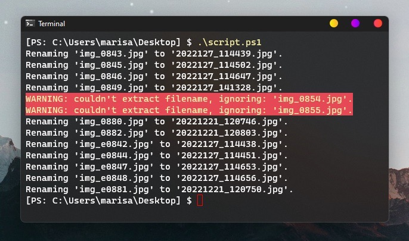

# scripts

A collection of scripts that I use for my very specific, niche tasks.


---


# img_rename.ps1

Description: a Windows Powershell 5.0 script that renames all images in a directory based on their date.

Logic:

1) Use date taken, otherwise use date modified, otherwise do not rename.
2) If duplicate exists, keep incrementing the number appended at the end.

The low performance comes from the fact that each filename is compared against all filenames in order to avoid duplicates.

Still, it's faster than doing it manually.




---


# is_rosetta_installed.sh

Description: a Bash script that checks if Rosetta 2 is installed on ARM64 Macbooks.

Rosetta 2 translates x86 software to ARM64.

```
[~] $ ./is_rosetta_installed.sh
Yes, Rosetta 2 is installed.
```


---


# pip_update.py

Description: a Python script that updates all pip packages at once.

```
[~] $ python3 pip_update.py
Found 3 packages.
$ pip install --upgrade pip setuptools wheel
Requirement already satisfied: pip in /opt/homebrew/lib/python3.11/site-packages (23.3.1)
Requirement already satisfied: setuptools in /opt/homebrew/lib/python3.11/site-packages (69.0.1)
Requirement already satisfied: wheel in /opt/homebrew/lib/python3.11/site-packages (0.41.3)
```
